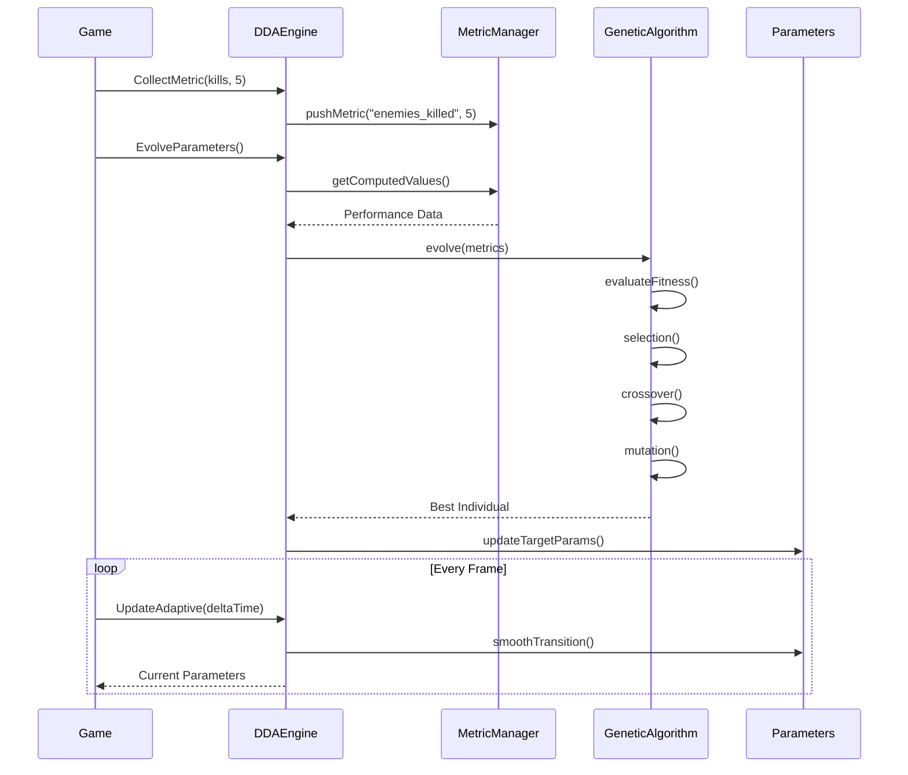

# Dynamic Difficulty Adjustment Engine - Technical Report

## Overview

DDAEngine_CPP is a sophisticated Dynamic Difficulty Adjustment (DDA) system designed for game development. It uses genetic algorithms to evolve game parameters based on player performance metrics, creating an adaptive gaming experience that automatically adjusts to player skill levels. The system provides:

- **Real-time difficulty adaptation** through AI and procedural content generation (PCG) parameter tuning
- **Player performance tracking** with comprehensive metrics collection and analysis
- **Evolutionary optimization** using genetic algorithms to find optimal difficulty settings
- **Seamless integration** with game engines through a clean C API
- **Multi-mode operation** supporting adaptive, fixed, and learning modes

## Design Philosophy

### Core Principles

The DDAEngine is built on several fundamental design principles that guide its architecture and implementation:

#### 1. **Player-Centric Adaptation**
The system prioritizes player experience by continuously monitoring performance metrics and adjusting game difficulty to maintain an optimal challenge level. Rather than forcing players into predefined difficulty categories, the engine creates a personalized experience that evolves with the player's skill progression.

#### 2. **Non-Intrusive Integration**
The engine is designed as a separate module that can be integrated into existing game architectures without requiring significant refactoring. Through its C API and plugin architecture, games can adopt DDA capabilities with minimal code changes.

#### 3. **Data-Driven Evolution**
All adaptation decisions are based on quantifiable metrics rather than heuristics. The system collects, analyzes, and responds to actual player behavior data, ensuring that difficulty adjustments are grounded in measurable performance indicators.

#### 4. **Smooth Transitions**
Recognizing that abrupt difficulty changes can break immersion, the engine implements sophisticated interpolation algorithms to ensure all parameter adjustments happen gradually and imperceptibly during gameplay.

#### 5. **Modularity and Extensibility**
The architecture follows SOLID principles, particularly the Open/Closed Principle, allowing developers to extend the system with new metrics, parameters, or adaptation strategies without modifying core functionality.

## Core Techniques

### 1. Genetic Algorithm for Parameter Evolution

The engine employs a genetic algorithm (GA) to evolve optimal game parameters based on player performance. This evolutionary approach offers several advantages:

```cpp
// Population-based evolution with configurable parameters
GeneticAlgorithm(size_t popSize = 50, size_t elite = 5, 
                 float mutRate = 0.1f, float crossRate = 0.7f)
```

**Key GA Components:**
- **Population Management**: Maintains 50 individuals (parameter sets) that compete based on fitness
- **Tournament Selection**: Uses 3-way tournament selection to choose parents, balancing exploration and exploitation
- **Uniform Crossover**: Each gene has 50% probability of coming from either parent
- **Adaptive Mutation**: 10% mutation rate with parameter-specific constraints
- **Elitism**: Preserves top 5 performers to ensure solution quality never degrades

### 2. Multi-Metric Fitness Evaluation

The fitness function combines multiple performance indicators with weighted contributions:

```cpp
float calculateFitness(const DDAParameters& params, const MetricManager& metrics) {
    float fitness = 100.0f;
    
    // Death rate component (30% weight)
    float deathPenalty = std::abs(deathRate - idealDeathRate) * 30.0f;
    
    // Completion time component (25% weight)
    float timePenalty = normalizeMetric(avgTime, 60.0f, 600.0f, idealCompletionTime) * 25.0f;
    
    // Accuracy component (20% weight)
    float accuracyPenalty = std::abs(avgAccuracy - idealAccuracy) * 20.0f;
    
    // Balance and parameter penalties
    fitness -= (deathPenalty + timePenalty + accuracyPenalty + balancePenalty);
    
    return std::max(0.0f, fitness);
}
```

### 3. Real-Time Parameter Interpolation

To ensure smooth gameplay experience, the engine uses frame-based linear interpolation:

```cpp
void smoothParameterTransition(float deltaTime) {
    float lerpSpeed = 0.5f;
    float t = std::min(1.0f, lerpSpeed * deltaTime);
    
    // Smooth interpolation for each parameter
    currentParams = lerp(currentParams, targetParams, t);
}
```

### 4. Template-Based Type-Safe Metrics System

The metrics system leverages C++20 concepts for compile-time type safety:

```cpp
template <typename T>
concept IsAveragable = requires(T a, T b) {
    { a + b } -> std::convertible_to<T>;
    { a / b } -> std::convertible_to<T>;
};

template <typename T>
struct DataStore {
    std::deque<T> data;
    T average() const requires (IsAveragable<T>);
};
```

### 5. Sliding Window Data Analysis

The system implements configurable sliding windows for recent performance focus:
- Maintains recent performance history (default: last 30 data points)
- Automatically removes outdated metrics
- Supports both windowed and cumulative analysis modes

### 6. Player Skill Level Calculation

Multi-factor skill assessment algorithm:

```cpp
float calculatePlayerSkillLevel() const {
    float skillLevel = 0.5f;  // Base skill level
    
    // Time-based performance (30% weight)
    skillLevel = skillLevel * 0.7f + timeScore * 0.3f;
    
    // Accuracy metrics (30% weight) 
    skillLevel = skillLevel * 0.7f + accuracy * 0.3f;
    
    // Death rate analysis (20% weight)
    float deathScore = 1.0f - std::min(1.0f, deathRate);
    skillLevel = skillLevel * 0.8f + deathScore * 0.2f;
    
    return std::max(0.0f, std::min(1.0f, skillLevel));
}
```

### 7. Level Generation Hints System

The engine provides contextual hints for procedural generation:

```cpp
nlohmann::json getLevelGenerationHints() const {
    hints["recommended_difficulty"] = calculatePlayerSkillLevel();
    
    if (skillLevel < 0.3f) hints["level_type"] = "tutorial";
    else if (skillLevel < 0.6f) hints["level_type"] = "standard";
    else if (skillLevel < 0.85f) hints["level_type"] = "challenging";
    else hints["level_type"] = "expert";
}
```

## System Architecture

### High-Level Architecture Overview

```
┌─────────────────────────────────────────────────────────────┐
│                        Game Application                       │
│                         (Unity/Unreal)                        │
└─────────────────────────┬───────────────────────────────────┘
                          │ C API Interface
┌─────────────────────────┴───────────────────────────────────┐
│                      DDAEngineAPI (C)                        │
│  • Platform-independent interface                            │
│  • Memory management wrapper                                 │
│  • Type marshalling                                          │
└─────────────────────────┬───────────────────────────────────┘
                          │
┌─────────────────────────┴───────────────────────────────────┐
│                    DDAEngine Core (C++)                      │
│  ┌─────────────────┐  ┌──────────────┐  ┌───────────────┐  │
│  │  MetricManager  │  │   Genetic    │  │   Parameter   │  │
│  │   (Singleton)   │  │  Algorithm   │  │   Manager     │  │
│  └────────┬────────┘  └──────┬───────┘  └───────┬───────┘  │
│           │                   │                   │          │
│  ┌────────┴────────┐  ┌──────┴───────┐  ┌───────┴───────┐  │
│  │  Metric Types   │  │  Population  │  │      AI       │  │
│  │  • Count        │  │  Management  │  │  Parameters   │  │
│  │  • Average      │  │              │  │               │  │
│  │  • Sum          │  │   Fitness    │  │     PCG       │  │
│  │  • Variance     │  │  Evaluation  │  │  Parameters   │  │
│  └─────────────────┘  └──────────────┘  └───────────────┘  │
└──────────────────────────────────────────────────────────────┘
```

### Component Interactions



### Key Architectural Patterns

1. **Singleton Pattern**: Used for global access to MetricManager and DDAEngine
2. **Template Method Pattern**: Metric computation strategies
3. **Strategy Pattern**: Different DDA modes (Adaptive/Fixed/Learning)
4. **Observer Pattern**: Implicit in metric collection system
5. **Facade Pattern**: C API provides simplified interface to C++ internals

### Detailed Component Architecture

#### DDA Engine Core (DDAEngine.hpp/cpp)
The heart of the system is a singleton-pattern engine that:
- **Manages game difficulty parameters** through AI and PCG (Procedural Content Generation) settings
- **Operates in three modes**:
  - **Adaptive**: Smoothly transitions parameters over time using interpolation
  - **Fixed**: Maintains static parameters for consistent difficulty
  - **Learning**: Continuously evolves parameters based on ongoing performance
- **Features smooth parameter interpolation** using linear interpolation (lerp) for gradual difficulty changes
- **Tracks player performance history** maintaining up to 100 recent performance records

#### Parameter System (DDAParameters.hpp)
A hierarchical parameter structure with:
- **AIParameters**: 
  - `aggressiveness` (0.0-1.0): Enemy attack behavior intensity
  - `reactionTime` (0.1-3.0s): Enemy response delay
  - `accuracy` (0.0-1.0): Enemy hit probability
  - `movementSpeed` (0.1-3.0x): Enemy movement multiplier
  - `detectionRange` (1.0-50.0): Enemy awareness radius
  - `attackFrequency` (0.0-1.0): Attack rate modifier
- **PCGParameters**:
  - `enemyDensity` (0.0-1.0): Spawn rate modifier
  - `powerUpFrequency` (0.0-1.0): Item spawn probability
  - `obstacleComplexity` (0.0-1.0): Level complexity factor
  - `pathBranching` (0.0-1.0): Level path diversity
  - `hazardIntensity` (0.0-1.0): Environmental danger level
  - `minEnemiesPerRoom` (0-10): Minimum enemy count
  - `maxEnemiesPerRoom` (0-20): Maximum enemy count

#### Metrics System Architecture
A flexible, type-safe metrics collection framework:

**MetricManager (Singleton)**:
```cpp
std::unordered_map<std::string, std::unique_ptr<Metric>> metrics;
```
- Manages all metrics through a hash map
- Supports multiple metric types (SUM, AVERAGE, COUNT, MINIMUM, MAXIMUM, UNIQUE_COUNT, VARIANCE, STD_DEV)
- Type-safe metric storage using templates

**MetricData (Template Class)**:
```cpp
template <typename T>
struct MetricData : Metric {
    V value;
    DataStore<V> dataStore;
};
```

#### C API Integration
The C API provides 23 exported functions for complete engine control:
- Initialization and shutdown
- Metric collection (float and int variants)
- Parameter retrieval and modification
- Mode control and evolution triggers
- JSON import/export for persistence

## Demo Implementation - Unity Integration

### Integration Overview

The Unity integration demonstrates how the DDAEngine seamlessly integrates with a game engine through its C API. The implementation consists of three main components:

### 1. DDAEngineWrapper - Core Integration Layer

```csharp
public class DDAEngineWrapper : MonoBehaviour
{
    // Singleton implementation for global access
    private static DDAEngineWrapper instance;
    
    // P/Invoke declarations for C API
    [DllImport("DDAEngine")]
    private static extern void DDA_Initialize();
    
    [DllImport("DDAEngine")]
    private static extern void DDA_GetAIParameters(out AIParameters outParams);
    
    // Initialization in Unity lifecycle
    void Awake()
    {
        DDA_Initialize();
        DDA_SetIdealMetrics(300f, 0.2f, 0.7f);  // 5 min levels, 20% death rate, 70% accuracy
        DDA_SetMode((int)DDAMode.Adaptive);
        DDA_SetEvolutionEnabled(1);
    }
    
    // Smooth parameter updates every frame
    void Update()
    {
        DDA_UpdateAdaptive(Time.deltaTime);
    }
}
```

### 2. Gameplay Metric Collection

The wrapper provides intuitive methods for collecting gameplay metrics:

```csharp
public class GameplayExample
{
    void OnEnemyKilled()
    {
        DDAEngineWrapper.Instance.RecordEnemyKill();
        DDAEngineWrapper.Instance.RecordShot(true);  // Hit
    }
    
    void OnPlayerDeath()
    {
        DDAEngineWrapper.Instance.RecordPlayerDeath();
    }
    
    void OnLevelComplete()
    {
        DDAEngineWrapper.Instance.EndLevel();  // Submits all metrics
    }
}
```

### 3. AI Behavior Adaptation

Enemy AI dynamically adjusts behavior based on DDA parameters:

```csharp
public class EnemyAI : MonoBehaviour
{
    private AIParameters aiParams;
    
    void Update()
    {
        // Fetch latest AI parameters
        aiParams = DDAEngineWrapper.Instance.GetAIParameters();
        
        // Apply parameters to behavior
        float moveSpeed = aiParams.movementSpeed * 5f;
        float detectionRange = aiParams.detectionRange;
        
        // Detection and movement logic
        if (PlayerInRange(detectionRange))
        {
            MoveTowardsPlayer(moveSpeed);
            
            // Attack frequency based on DDA
            if (Random.value < aiParams.attackFrequency * Time.deltaTime)
            {
                AttackWithAccuracy(aiParams.accuracy);
            }
        }
    }
}
```

### 4. Procedural Level Generation

The level generator uses PCG parameters to create adaptive content:

```csharp
public class LevelGenerator : MonoBehaviour
{
    public void GenerateLevel()
    {
        PCGParameters pcgParams = DDAEngineWrapper.Instance.GetPCGParameters();
        string hints = DDAEngineWrapper.Instance.GetLevelGenerationHints();
        
        // Enemy placement based on DDA
        for (int room = 0; room < numRooms; room++)
        {
            int enemyCount = Random.Range(
                pcgParams.minEnemiesPerRoom, 
                pcgParams.maxEnemiesPerRoom + 1
            );
            
            SpawnEnemiesInRoom(room, enemyCount);
        }
        
        // Powerup distribution
        int powerupCount = Mathf.RoundToInt(numRooms * pcgParams.powerUpFrequency * 3);
        SpawnPowerups(powerupCount);
        
        // Obstacle complexity
        int obstacleCount = Mathf.RoundToInt(50 * pcgParams.obstacleComplexity);
        SpawnObstacles(obstacleCount);
    }
}
```

### Integration Benefits

1. **Minimal Code Changes**: Games only need to add metric collection calls at key events
2. **Real-Time Adaptation**: Parameters update smoothly without gameplay interruption
3. **Flexible Configuration**: All ideal metrics and evolution settings are configurable
4. **Performance Optimized**: C++ core ensures minimal overhead
5. **Platform Independent**: Works on any platform supporting native plugins

### Data Flow in Unity Integration

```
Unity Game Events → DDAEngineWrapper → C API → DDAEngine Core
                                                      ↓
                                                 Metric Analysis
                                                      ↓
                                                 GA Evolution
                                                      ↓
Unity Gameplay ← AI/PCG Parameters ← C API ← Updated Parameters
```

This integration demonstrates how the DDAEngine provides a complete solution for adaptive difficulty, from metric collection through parameter evolution to real-time gameplay adjustment, all while maintaining clean separation between the game logic and the adaptation system.

## Advanced Features & Technical Details

### Performance Optimizations

1. **Static String Buffers**: The C API uses static unique_ptr strings to avoid repeated allocations
2. **Template-Based Type Efficiency**: Compile-time type resolution reduces runtime overhead
3. **Deque-Based Storage**: O(1) insertion and removal for sliding window operations
4. **Lazy Evaluation**: Metrics are only computed when requested

### Memory Management

- **Smart Pointers**: Extensive use of unique_ptr for automatic memory management
- **RAII Principles**: Resource acquisition is initialization pattern throughout
- **No Manual Memory Management**: Eliminates memory leaks and dangling pointers

### Error Handling Strategy

```cpp
try {
    MetricManager::getInstance()->pushMetric(metricName, value);
} catch (...) {
    // Silent failure to prevent game crashes
}
```

### Evolution Timing Control

- Default evolution interval: 5 minutes (configurable)
- Learning mode: Immediate evolution after each level
- Adaptive mode: Smooth transitions prevent jarring changes

### JSON Serialization Format

```json
{
  "current_parameters": {
    "ai": {
      "aggressiveness": 0.5,
      "reactionTime": 1.0,
      "accuracy": 0.7
    },
    "pcg": {
      "enemyDensity": 0.5,
      "powerUpFrequency": 0.3
    },
    "difficultyMultiplier": 1.0
  },
  "player_skill_level": 0.65,
  "fitness_score": 85.2,
  "generation_hints": {
    "level_type": "standard",
    "recommended_difficulty": 0.65
  }
}
```

## Architecture Strengths

1. **Modularity**: Clean separation between metrics, evolution, and parameters
2. **Extensibility**: Easy to add new metrics or parameter types
3. **Type Safety**: Heavy use of C++ type system for compile-time guarantees
4. **Performance**: Efficient data structures and algorithms
5. **Integration**: Well-designed C API for cross-language compatibility
6. **Real-World Ready**: Production-quality code with proper error handling

## Potential Improvements

1. **Thread Safety**: Add mutex protection for concurrent access
2. **Persistence**: Implement save/load for evolution history
3. **Analytics**: Add built-in visualization tools
4. **Network Support**: Enable multiplayer difficulty synchronization
5. **Machine Learning**: Integrate neural networks for more sophisticated adaptation
6. **Profiling**: Add performance monitoring capabilities

## Conclusion

The DDAEngine represents a sophisticated approach to dynamic difficulty adjustment in games. By combining genetic algorithms, real-time parameter interpolation, and comprehensive metrics tracking, it creates an adaptive gaming experience that responds intelligently to player skill levels. The clean architecture, modern C++ implementation, and thoughtful API design make it suitable for integration into production game engines while maintaining extensibility for future enhancements.